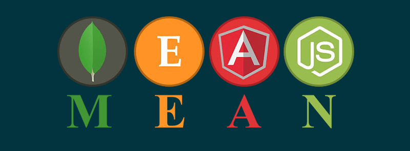

# MEAN Stack

April 2021

> 🔨 From udemy: [La MEAN stack par la pratique - Samir Medjdoub / Code Concept](https://www.udemy.com/course/la-mean-stack-par-la-pratique/)

---

## Dependancies

### API

- [express](https://www.npmjs.com/package/express): Fast, unopinionated, minimalist web framework for node.

`npm i express`

- [eslint](https://www.npmjs.com/package/eslint): ESLint is a tool for identifying and reporting on patterns found in ECMAScript/JavaScript code.

`npm i eslint --save-dev`

`npm install --save-dev eslint-config-prettier`

- [cors](https://www.npmjs.com/package/cors): CORS is a node.js package for providing a Connect/Express middleware that can be used to enable CORS with various options.

`npm i cors`

- [nodemon](https://www.npmjs.com/package/nodemon): nodemon is a tool that helps develop node.js based applications by automatically restarting the node application when file changes in the directory are detected.

`npm install --save-dev nodemon`

- [mongoDB](https://www.mongodb.com/): MongoDB is a general purpose, document-based, distributed database built for modern application developers and for the cloud era.

**WSL2**:

- `sudo service mongodb status`: status for checking the status of your database.
- `sudo service mongodb start`: start to start running your database.
- `sudo service mongodb stop`: stop to stop running your database.

**Shell**

- `mongo`: MongoDB shell
- `show dbs`: View databases

- [mongoose](https://www.npmjs.com/package/mongoose): Mongoose is a MongoDB object modeling tool designed to work in an asynchronous environment. Mongoose supports both promises and callbacks.

`npm i mongoose`

- [body-parser](https://www.npmjs.com/package/body-parser): Node.js body parsing middleware.

`npm i body-parser`

## Useful links

- [codeconcept/whisky-cms-ng](https://github.com/codeconcept/whisky-cms-ng).
- [codeconcept/whisky-cms-ng-srv](https://github.com/codeconcept/whisky-cms-ng-srv).
- [Comment installer MongoDB sur Ubuntu 20.04](https://www.digitalocean.com/community/tutorials/how-to-install-mongodb-on-ubuntu-20-04-fr).
- [Install MongoDB - WSL 2](https://docs.microsoft.com/en-us/windows/wsl/tutorials/wsl-database).
- [The mongo Shell](https://docs.mongodb.com/manual/mongo/).
