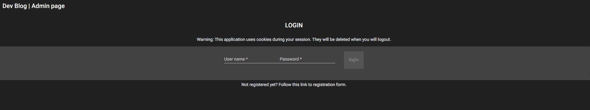
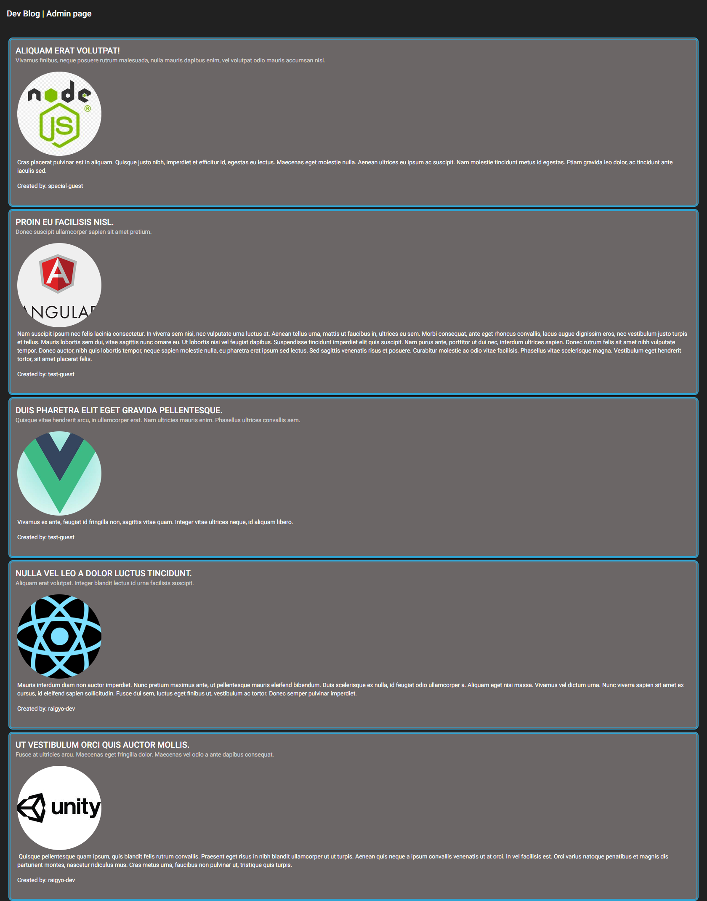
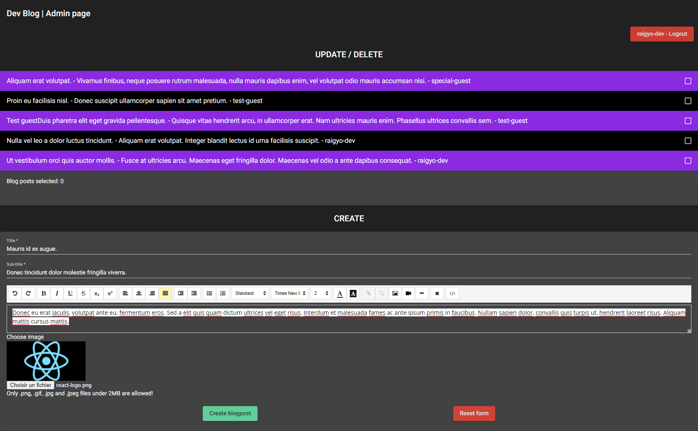
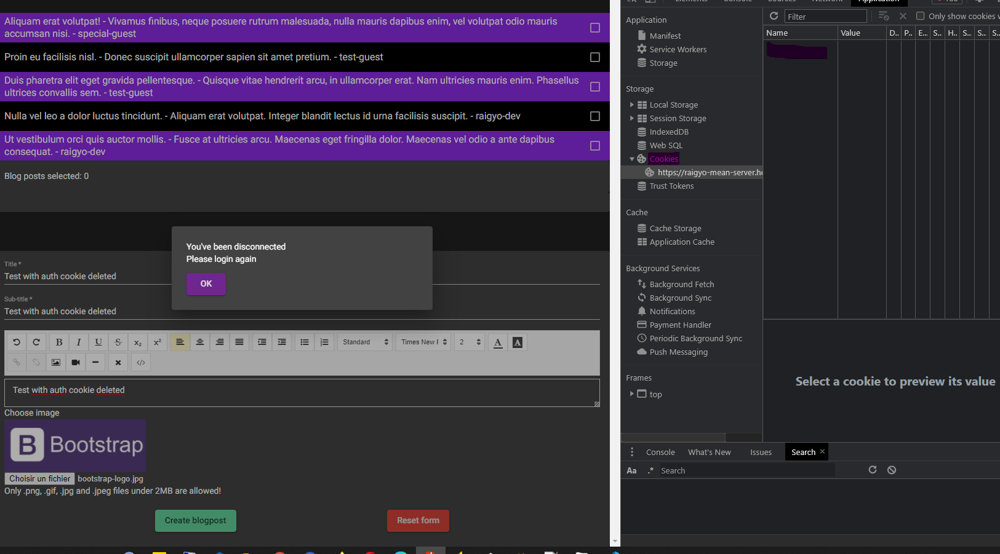
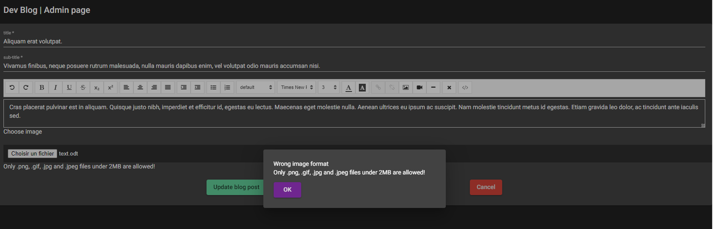
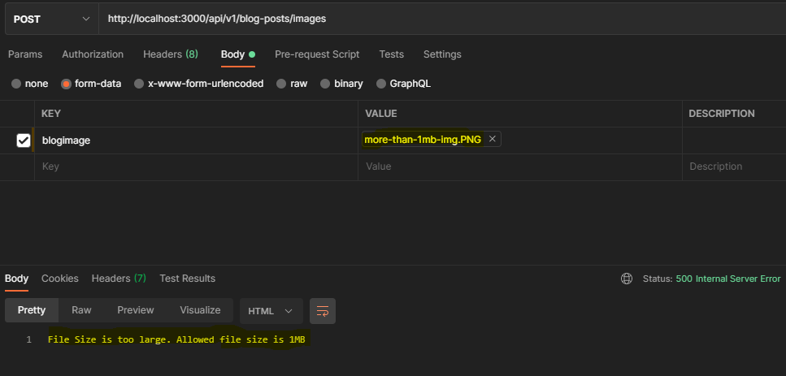

# MEAN Stack: Developers Blog

April / May 2021

> 🔨 Blog for developers using Node and Express, MongoDB and Mongoose as ODM, and Angular on Client side (MEAN Stack). From udemy: [La MEAN stack par la pratique - Samir Medjdoub / Code Concept](https://www.udemy.com/course/la-mean-stack-par-la-pratique/) with some improvements.

---

Mean Stack refers to a collection of JavaScript technologies used to develop web applications. Therefore, from the client to the server and from server to database, everything is based on JavaScript. MEAN is a full-stack development toolkit used to develop a fast and robust web applications.

MEAN is a user-friendly stack which is the ideal solution for building dynamic websites and applications. This free and open-source stack offers a quick and organized method for creating rapid prototypes for web-based applications.

MEAN is comprised of four different technologies:

- MongoDB express is a schemaless NoSQL database system
- Express JS is a framework used to build web applications in Node
- AngularJS is a JavaScript framework developed by Google
- Node.js is a server-side JavaScript execution environment


With this app, developers can register and login to add and share some articles about technologies, languages, librairies and so on.

The homepage displays all the articles (extracts). When clicking on them, we have access to the complete article.
Authors can add, delete or update their own articles. Admin have the right to do the same but for all authors.

Angular is the part that manage displaying of the views according to events. But evything is Managed with the node server including session management (passport), password encryption and credential validation (Mongoose schemas) or user registrations, sending the articles of the author only or all to the admins, check size and mime of the images (Multer) or send errors to the client side.

## Test online

Test the application on [Heroku](https://raigyo-mean-server.herokuapp.com/).

You can test the app using these credentials if you don't want to register:

User name: special-guest

Password: MeanStack-2021-05-25

NB: due to the fact that the application is hosted on Heroku using external services like MongoDB Atlas, it can be slow to start (services use cold start) and when running.











## Test localy

With file uploads and MongoDB on local:

Clone and use [dev-version](https://github.com/Raigyo/mean-stack-whisky/tree/dev-version) branch.

With cloudinary and MongoDB Atlas instead, clone main.

**Start server**

You need MongoDB installed for dev-version.

`sudo service mongodb start`

From root: `cd server`

`npm install`

`npm start`

The server should run at [http://localhost:3000](http://localhost:3000).

**Start client app**

From root: `cd client`

`npm install`

`npm start`

The app should run at [http://localhost:4200](http://localhost:4200).

Whatever the version, environment variables will have to be change from both server and client side following the exemples.



## Files and components: Front End part

- _./src/app/app.module.ts_: import / export all modules used in the application.
- _./src/app/app-routing.module.ts_: routing.
- _./src/app/material.module.ts_: import / export modules related to material design. _./src/app/material.module.ts_ has to be imported in _./src/app/app.module.ts_.

**Home**

- _./src/app/app.component.html_: \<router-outlet\> add the content from routing component _./src/app/app-routing.module.ts_.

**blogposts list**

- _./src/app/models/blogpost.ts_: typed interface for Blogpost.
- _./src/app/services/blogpost.service.ts_: request on MongoDB.
- _./src/app/blogpost-list/blogpost-list.component.ts_: observable on Blogpost[].
- _./src/app/blogpost-list/blogpost-list.component.html_: view. Uses routerLink to not reload the page when we click on a link.
- _./src/environments/environment.ts_: images path

**blogpost by id**

- _./src/app/models/blogpost.ts_: typed schema.
- _./src/app/app-routing.module.ts_: add a route for "blog-posts/:id".
- _./src/app/services/blogpost.service.ts_: request on MongoDB.
- _./src/app/services/blogpost/blogpost.component.ts_: observable on Blogpost. Uses ActivatedRoute to retrieve url and id.
- _./src/app/blogpost/blogpost.component.html_: view.

Exemple to display detail of an object: `<div>{{blogPost$ | async | json}}</div>`

**admin**

- _./src/app/admin/admin.component.html_: view with CRUD.
- _./src/app/admin/admin.component.ts_: request on MongoDB. CRUD on all articles.

**blogposts create**

- _./src/app/services/blogpost.service.ts_: request on MongoDB + `subject` to refresh _./src/app/admin/admin.component.html_. Method upload().
- _./src/app/blogpost-create/blogpost-create.component.html_: view with submission form.
- _./src/app/blogpost-create/blogpost-create.component.ts_: manage FormGroup and dispatching for refresh.

**blogposts edit**

- _./src/app/services/blogpost.service.ts_: request on MongoDB
- _./src/app/blogpost-edit/blogpost-edit.component.html_: Template driven form
- _./src/app/blogpost-edit/blogpost-edit.component.ts_: Manage upload and updated blogpost

**auth**

- _./src/app/auth/auth.component.html_: Display login.
- _./src/app/auth/auth.component.ts_: Manage login.
- _./src/app/models/user.ts_: typed interface for login page.
- _./src/app/services/auth.service.ts_: Connect to base url. Manage login/logout/register routes.
- \_./src/app/services/add-cookie.interceptor.ts: HTTP Interceptor: centralizes the sending of the header in each request (used for the cookie).

**register**

- _./src/app/register/auth.component.html_: Display register.
- _./src/app/register/auth.component.ts_: Manage register.
- _./src/app/models/user.ts_: typed interface for Blogpost.
- _./src/app/services/auth.service.ts_: Connect to base url. Manage login/logout/register routes.

## Files and components: Back-end part

- _./appjs_: Express and Mongo connection. Static folders. Session mudlewares
- _./utils/resize.js_: Helper to resize images.
- _./api/models/blogpost.js_: Mongoose model for CRUD.
- _./api/v1/index.js_: Routes + Api CRUD.
- _./auth/models/user.js_: Mongoose model for users.
- _./auth/routes/index.js_: Routes + Api users.

## Angular / JS concepts

### Observable

An observable is source of ollections of multiple values pushed when we suscribe.

### Observer

An Observer is a consumer of values delivered by an Observable. Observers are simply a set of callbacks, one for each type of notification delivered by the Observable: `next`, `error`, and `complete`.

### Subject

A subject is a special type of Observable that allows values to be multicasted to many Observers. While plain Observables are unicast (each subscribed Observer owns an independent execution of the Observable), Subjects are multicast.

### Pipeable Operators

A Pipeable Operator is a function that takes an Observable as its input and returns another Observable. It is a pure operation: the previous Observable stays unmodified. Subscribing to the output Observable will also subscribe to the input Observable.

### Higher-order Observables

We define a higher-order Observable whenever we use data emitted from one Observable to emit another Observable. ... In the code above, we subscribe to the outer Observable but we don't subscribe to the inner Observable. Since Observables are lazy, they won't emit until subscribed.

### Modules

In Angular, a module is a mechanism to group components, directives, pipes and services that are related, in such a way that can be combined with other modules to create an application. An Angular application can be thought of as a puzzle where each piece (or each module) is needed to be able to see the full picture.

Ex: `ng g m material --flat` => Ceate module _\_src/app/material.module.ts_

### Components

Components are the main building block for Angular applications. Each component consists of: An HTML template that declares what renders on the page. A Typescript class that defines behavior. A CSS selector that defines how the component is used in a template.

Ex: `ng g c blogpost --skip-tests --module=app` => Create new blogpost component

### Models: Interfaces

We use interfaces instead classes because we don't need behaviors (methods).

Ex: Interface _blogpost.ts_ in _\_src/app/models_

### Services

Angular services are singleton objects that get instantiated only once during the lifetime of an application. ... The main objective of a service is to organize and share business logic, models, or data and functions with different components of an Angular application.

Ex: `ng g s blogpost` => Create new blogpost service

### Reactive form vs Template driven form

Template Driven Forms Features

- Easy to use
- Suitable for simple scenarios and fails for complex scenarios
- Similar to AngularJS
- Two way data binding(using [(NgModel)] syntax)
- Minimal component code
- Automatic track of the form and its data(handled by Angular)
- Unit testing is another challenge

EX: _./src/app/blogpost-create/blogpost-edit.component.html_:

Reactive Forms Features

- More flexible, but needs a lot of practice
- Handles any complex scenarios
- No data binding is done (immutable data model preferred by most developers)
- More component code and less HTML markup
- Reactive transformations can be made possible such as
- Handling a event based on a debounce time
- Handling events when the components are distinct until changed
- Adding elements dynamically
- Easier unit testing

EX: _./src/app/blogpost-create/blogpost-create.component.html_:

### Two way binding

Two-way binding gives components in your application a way to share data. Use two-way binding to listen for events and update values simultaneously between parent and child components.

### @Injectable

Dependency Injection is often more simply referred to as DI. The paradigm exists throughout Angular. It keeps code flexible, testable, and mutable. Classes can inherit external logic without knowing how to create it. Any consumers of those classes also do not need to know anything.

DI saves classes and consumers alike from having to know more than necessary. Yet the code is as modular as it was before thanks to the mechanisms supporting DI in Angular.

### HTTP Interceptor

The Angular HTTP Interceptor is introduced along with the new HTTPClientModule. The Interceptor helps us to modify the HTTP Request by intercepting it before the Request is sent to the back end. The Interceptor can be useful for adding custom headers to the outgoing request, logging the incoming response, etc.

### Serialization

The process whereby an object or data structure is translated into a format suitable for transferral over a network, or storage (e.g. in an array buffer or file format).


In JavaScript, for example, you can serialize an object to a JSON string by calling the function JSON.stringify().

## Dependancies

### API

- [express](https://www.npmjs.com/package/express): Fast, unopinionated, minimalist web framework for node.

`npm i express`

- [eslint](https://www.npmjs.com/package/eslint): ESLint is a tool for identifying and reporting on patterns found in ECMAScript/JavaScript code.

`npm i eslint --save-dev`

`npm install --save-dev eslint-config-prettier`

- [cors](https://www.npmjs.com/package/cors): CORS is a node.js package for providing a Connect/Express middleware that can be used to enable CORS with various options.

`npm i cors`

- [nodemon](https://www.npmjs.com/package/nodemon): nodemon is a tool that helps develop node.js based applications by automatically restarting the node application when file changes in the directory are detected.

`npm install --save-dev nodemon`

- [mongoDB](https://www.mongodb.com/): MongoDB is a general purpose, document-based, distributed database built for modern application developers and for the cloud era.

**WSL2**:

- `sudo service mongodb status`: status for checking the status of your database.
- `sudo service mongodb start`: start to start running your database.
- `sudo service mongodb stop`: stop to stop running your database.

**Shell**

- `mongo`: MongoDB shell
- `show dbs`: View databases
- `use [DB_NAME]`: Choose databases
- `show collections`: View collections
- `db.[COLLECTION_NAME].find({})`: View documents in collection

- [mongoose](https://www.npmjs.com/package/mongoose): Mongoose is a MongoDB object modeling tool designed to work in an asynchronous environment. Mongoose supports both promises and callbacks.

`npm i mongoose`

- [multer](https://www.npmjs.com/package/multer): Multer is a node.js middleware for handling multipart/form-data, which is primarily used for uploading files.

`npm i multer`

- [sharp](https://www.npmjs.com/package/sharp): The typical use case for this high speed Node.js module is to convert large images in common formats to smaller, web-friendly JPEG, PNG, WebP and AVIF images of varying dimensions.

`npm i sharp`

- [passport](https://www.npmjs.com/package/passport): Passport is Express-compatible authentication middleware for Node.js.

`npm i passport cookie-parser express-session passport-local`

- [dotenv](https://www.npmjs.com/package/dotenv): PDotenv is a zero-dependency module that loads environment variables from a .env file into process.env. Storing configuration in the environment separate from code is based on The Twelve-Factor App methodology.

`npm i dotenv`

- [npm i mongoose-unique-validator](https://www.npmjs.com/package/mongoose-unique-validator): mongoose-unique-validator is a plugin which adds pre-save validation for unique fields within a Mongoose schema.

`npm i mongoose-unique-validator`

- [argon2](https://www.npmjs.com/package/argon2): A library to help you hash passwords.

`npm i argon2`

- [password-validator](https://www.npmjs.com/package/password-validator): A library to check password validity.

`npm i password-validator`

- [cloudinary](https://www.npmjs.com/package/cloudinary): Cloudinary is a cloud service that offers a solution to a web application's entire image management pipeline..

`npm i cloudinary`

#### Tip

**Kill process on port (here 3000)**

```batch
lsof -i:3000
kill -9 [PID]
```

### APP

- [Angular CLI](https://angular.io/cli): The Angular CLI is a command-line interface tool that you use to initialize, develop, scaffold, and maintain Angular applications directly from a command shell.

```batch
ng new my-first-project
cd my-first-project
ng serve
```

`npm install -g @angular/cli`

- [Angular Material](https://material.angular.io/): Material Design components for Angular.

`ng add @angular/material`

- [@kolkov/angular-editor](https://www.npmjs.com/package/ngx-editor): A simple native WYSIWYG/Rich Text editor for Angular 6-10+.

`npm i @kolkov/angular-editor`

- [@angular/flex-layout](https://www.npmjs.com/package/@angular/flex-layout): https://www.npmjs.com/package/@angular/flex-layout.

`npm i @angular/flex-layout`

## Heroku deploy

### Angular build

`cd client`

`ng build --prod --base-href --output-path ./../server/public/client`

### Server + app

On root:

`heroku login`

(`heroku create my-app`)

(`heroku git:remote -a my-app`)

`git add .`

`git commit -m "my message"`

`git subtree push --prefix server heroku master`

If errors, check with:

`heroku logs --tail`

## Useful links

- [codeconcept/whisky-cms-ng](https://github.com/codeconcept/whisky-cms-ng).
- [codeconcept/whisky-cms-ng-srv](https://github.com/codeconcept/whisky-cms-ng-srv).
- [Comment installer MongoDB sur Ubuntu 20.04](https://www.digitalocean.com/community/tutorials/how-to-install-mongodb-on-ubuntu-20-04-fr).
- [Install MongoDB - WSL 2](https://docs.microsoft.com/en-us/windows/wsl/tutorials/wsl-database).
- [The mongo Shell](https://docs.mongodb.com/manual/mongo/).
- [Moogose - Models](https://mongoosejs.com/docs/api/model.html).
- [Node.js Authentication with Passport](https://blog.cloudboost.io/node-js-authentication-with-passport-4a125f264cd4).
- [Using Argon2 with Node.js](https://www.youtube.com/watch?v=fEV3D0ZuBgM).
- [Angular la difference entre ngoninit et constructor](http://pierreterrat.com/angular-ngoninit-et-constructor/).
- [Angular Dependency Injection Explained with Examples](https://www.freecodecamp.org/news/angular-dependency-injection/).
- [Structural Directives](https://medium.com/@rm.dev/angular-enhancing-your-templates-with-else-as-eb92f1cc4037).
- [Comment gérer l’injection de dépendances dans angular?](http://pierreterrat.com/dependances-angular/).
- [Angular Forms - Template Driven & Reactive Forms | Explain](https://www.calibraint.com/blog/angular-formsl).
- [Angular - Text interpolation](https://angular.io/guide/interpolation#text-interpolation).
- [Angular - https://angular.io/guide/router](https://angular.io/guide/router).
- [Understanding Angular Property Binding and Interpolation](https://www.telerik.com/blogs/understanding-angular-property-binding-and-interpolation).
- [Interpolation Vs Property Binding in Angular2](https://www.codementor.io/@adekunleoyaniyi/interpolation-vs-property-binding-in-angular2-eu1tzbyn4?utm_content=68092897&utm_medium=social&utm_source=twitter).
- [Understanding Angular Property Binding and Interpolation](https://www.telerik.com/blogs/understanding-angular-property-binding-and-interpolation#:~:text=Property%20binding%20is%20the%20base,properties%20bound%20in%20the%20template.).
- [Angular 11 MatDialog Basics](https://www.developer.com/languages/javascript/angular-11-matdialog-basics/)
- [Theming your Angular Material app](https://v9.material.angular.io/guide/theming)
- [How to reset file input form after uploading the image in Angular?](https://stackoverflow.com/questions/54251208/how-to-reset-file-input-form-after-uploading-the-image-in-angular)
- [Angular2 set value for formGroup](https://stackoverflow.com/questions/38655613/angular2-set-value-for-formgroup)
- [How to use environment variables to configure your Angular application without a rebuild](https://www.jvandemo.com/how-to-use-environment-variables-to-configure-your-angular-application-without-a-rebuild/)
- [FormData.append()](https://developer.mozilla.org/en-US/docs/Web/API/FormData/append)
- [Tout pour la redirection HTTP vers HTTPS](https://www.webrankinfo.com/dossiers/techniques/redirection-http-https).
- [Deploy Git subdirectory to Heroku](https://medium.com/@shalandy/deploy-git-subdirectory-to-heroku-ea05e95fce1f).
- [Uploading Images to Cloudinary Using Multer and ExpressJS](https://medium.com/@joeokpus/uploading-images-to-cloudinary-using-multer-and-expressjs-f0b9a4e14c54).
